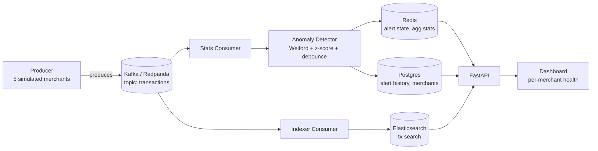

# PayWatch

## What it is

PayWatch is a real-time monitoring system for online payment platforms —
think of it as a scaled-down version of what Stripe or Adyen runs internally.
It watches transactions flowing in from multiple merchants at once and
automatically catches problems — a payment processor failing, a fraud attack,
a checkout outage — for each merchant individually, so one merchant's issue
never gets hidden inside a healthy-looking average across everyone else.

## Architecture



See [`docs/architecture.md`](docs/architecture.md) for the AWS deployment
topology (EC2, RDS, ElastiCache, GitHub Actions).

## Tech stack

Python, FastAPI, Kafka, Elasticsearch, Redis, PostgreSQL, Terraform, AWS (EC2, RDS, ElastiCache), Prometheus, GitHub Actions

## What it detects

Four metrics, tracked with an independent statistical baseline per merchant:

- **success_rate** — a payment processor failure or outage.
  *"Acme Store success rate dropped to 58% (baseline 96%, z-score -4.2)"*
- **volume_per_min** — the merchant's checkout is down and no payments are
  reaching the system.
  *"Bravo Retail volume dropped to 0 tx/min (baseline 340)"*
- **avg_fraud_score** — a new attack pattern, such as card testing or
  credential stuffing.
  *"Cypress Fashion fraud score shifted to 0.74 (baseline 0.11, z-score 6.1)"*
- **avg_latency_ms** — degradation in the downstream banking connection.
  *"Acme Store latency spiked to 4200ms (baseline 210ms)"*

## How to run locally

```bash
# Start Kafka, Elasticsearch, Postgres, Redis
docker compose up -d

# Create tables and seed 5 merchants
python scripts/apply_schema.py

# Start each of the following in its own terminal
cd producer && python main.py
cd consumers/indexer && python main.py
cd consumers/stats && python main.py
cd api && uvicorn main:app --reload

# Open the dashboard
open http://localhost:8000/dashboard/
```

## AWS deployment

Infrastructure is provisioned with Terraform, in two steps:

```bash
# 1. Bootstrap remote state (S3 bucket + DynamoDB lock table) — one-time
cd infra/bootstrap && terraform init && terraform apply

# 2. Provision everything else (VPC, RDS, ElastiCache, EC2, ECR, IAM/OIDC)
cd infra/main && terraform init && terraform apply
```

From there, every push to `main` triggers GitHub Actions to build and push
the 4 application images to ECR and deploy them to the EC2 instance over SSH
— authenticated via OIDC, with no long-lived AWS credentials stored in CI.

## Key design decisions

**Two parallel consumers, two consumer groups.** The indexer and stats
consumers both subscribe to the same `transactions` topic but in separate
Kafka consumer groups (`indexer-group`, `stats-group`), so each gets the full
stream independently. If they shared a group, Kafka would split the topic's
partitions between them and each would only ever see a fraction of the data.

**Per-merchant baselines, not a global one.** Each merchant gets its own
statistical baseline per metric. A single global baseline would mask
merchant-specific issues — if one merchant fails while another doubles in
volume, a blended average can look perfectly healthy. Per-tenant isolation is
the core decision that makes multi-tenancy actually meaningful here.

**Welford's algorithm, not `numpy.std()`.** `numpy.std()` needs every value
held in memory to compute a standard deviation — impossible on an unbounded,
continuous stream of transactions. Welford's online algorithm maintains a
running mean and variance in O(1) memory, updated incrementally on every new
value, regardless of how long the stream has been running.

**A debounce state machine, not "alert on every anomalous reading."** Without
it, a single 60-second incident would generate one alert per anomalous data
point — potentially hundreds of rows and a flooded dashboard. A
`HEALTHY → FIRING → RESOLVED` state machine fires exactly once per incident,
regardless of how long it lasts.

**Redis for hot state, Postgres for history.** Redis holds active alert state
and the latest aggregated stats — read on every API request, so it needs to
be fast. Postgres holds alert history and merchant metadata — durable,
queryable, the actual source of truth. Redis is fast but not durable by
default; if it restarts, hot state simply rebuilds from the next batch of
incoming transactions.

**OIDC federation over stored credentials.** GitHub Actions assumes an AWS
IAM role directly via OpenID Connect instead of using a long-lived access
key stored as a repository secret. Temporary credentials are issued fresh for
each workflow run and expire automatically when it completes.

## Demo

Trigger a real alert on demand against a running instance (grab a merchant's
UUID from `GET /merchants` first):

```bash
python scripts/inject_spike.py \
  --merchant-id <uuid> --merchant-name "Acme Store" \
  --type success_rate --duration 30
```

Watch the dashboard: that merchant's panel turns from green to red within the
30-second window while every other merchant stays green, a real alert appears
in `/merchants/{id}/alerts/active` with a description and z-score, and it
automatically clears once the spike ends and real traffic resumes.
