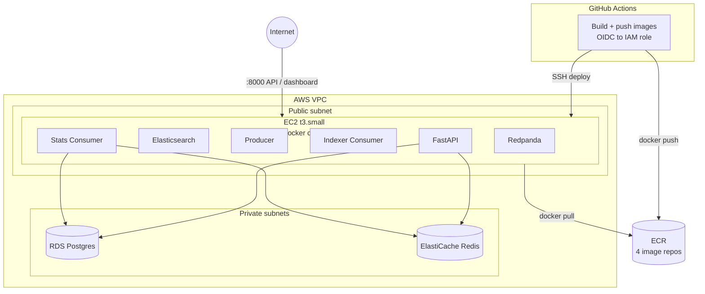

# AWS Deployment Architecture

PayWatch runs as a single Docker Compose stack on one EC2 instance, with
Postgres and Redis as managed AWS services (RDS and ElastiCache) in private
subnets. GitHub Actions builds and deploys on every push to `main` via OIDC —
no long-lived AWS credentials are stored anywhere in CI.

## What's where

**EC2 (public subnet, t3.small)** runs every stateless piece as a Docker
Compose service: Redpanda (Kafka-compatible broker), Elasticsearch, the
producer, both consumers, and the FastAPI app. Elastic IP for a stable public
address; only ports 22 (SSH) and 8000 (API/dashboard) are open to the
internet.

**RDS Postgres and ElastiCache Redis (private subnets)** hold the durable and
hot state respectively — alert history and merchant metadata in Postgres,
active alert state and aggregated stats in Redis. Neither is reachable from
outside the VPC; only the EC2 instance's security group is allowed in,
enforced via security-group-to-security-group rules rather than CIDR blocks.

**GitHub Actions** authenticates to AWS via OIDC (no stored access keys),
builds and pushes all 4 application images to ECR, then SSHes into the EC2
instance to pull the new images and run `docker compose up -d --pull always`.
A health check against `/health` confirms Postgres and Redis connectivity
before the deploy is considered successful.

## Why this shape, not something else

**EC2 + Docker Compose over EKS/ECS.** A managed container orchestrator adds
real operational complexity (VPC CNI, task definitions, service discovery)
for a single-instance workload that doesn't need auto-scaling or multi-node
scheduling. EC2 + Compose is SSH-debuggable and costs a fraction as much.

**Managed RDS/ElastiCache instead of running Postgres/Redis in the same
Compose stack as everything else.** Keeps stateful, durable services off the
instance that gets replaced on every infrastructure change (`ec2.tf` sets
`user_data_replace_on_change = true`, so the EC2 instance itself is treated
as disposable) — a Postgres container living on that same disposable instance
would lose its data on every replacement.

**Why Prometheus and Grafana live on the same EC2 instance, not managed
separately.** This is also the source of this project's biggest documented
production incident: adding two more containers to an already-tight 2GB
`t3.small` caused a real memory-exhaustion outage. See `CLAUDE.md`'s Issues
log for the full recovery story (memory tuning, a swap file, and a follow-on
disk-space incident from the swap file itself) — a deliberate accepted
tradeoff given this AWS account's plan cannot launch anything larger than
`t3.small`.
